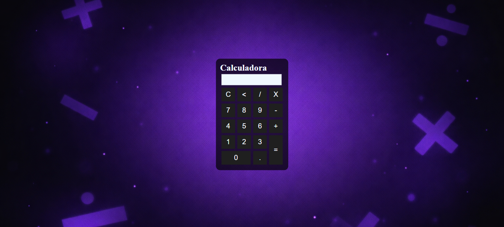

Este projeto é uma calculadora simples desenvolvida com HTML, CSS e JavaScript. A proposta foi colocar em prática o básico e construir algo funcional, com operações como soma, subtração, multiplicação e divisão.

O HTML foi utilizado para estruturar a calculadora, o CSS para cuidar do visual e o JavaScript para fazer a lógica funcionar, como os cliques nos botões e os cálculos exibidos no visor.

Durante o desenvolvimento, foi possível praticar conceitos importantes como manipulação do DOM, que é basicamente a forma de o JavaScript acessar e alterar os elementos do HTML, além do uso de funções e da integração entre as três tecnologias. Também ajudou a entender melhor como resolver pequenos erros e ajustar o funcionamento do código.

É um projeto simples, mas útil para reforçar a base do desenvolvimento web.
